大二下的期末实训课我选择了校内实训，老师要求搭建一个美妆的电商平台。在网站搭建起来后我觉得电子商务还是挺好玩的。在选择搭建方案时，我排除了自主开发前后端原始网站的方案。因为大一时我曾用 HTML+PHP 和 Python 开发过校内内网简易网站，深知从零搭建会面临诸多问题：后端逻辑容易出错、前端样式美观度不足且存在兼容性报错、数据库设计逻辑复杂等。基于以往经验，我果断决定采用成熟的平台模板来搭建电商平台。

Wordpress就是一个不错的选择。此前我曾用它搭建过个人博客，虽然后来觉得设计复杂便不再使用，但至少有过一次安装经验，而且我了解到不少实际运营的跨境电商小型网站都基于WordPress 部署，其丰富的高完成度插件和模板能够满足电商平台的功能需求。

  
在环境选择上，我采用了国内高校常用的 CentOS 7 系统，具体版本为 CentOS 7.9（其他 CentOS 版本亦可）。下面正式分享我搭建美妆电商平台的过程的分享。

### ✅ 什么是 CentOS？

**CentOS（Community ENTerprise Operating System）** 是一个**基于 RHEL（Red Hat Enterprise Linux）的企业级 Linux 操作系统**。

#### 特点：

- **稳定可靠**：广泛用于服务器部署，适合运行 WordPress、数据库、网站等服务。
    
- **开源免费**：相比 RHEL，CentOS 提供类似的功能但完全免费。
    
- **社区支持**：由开发者社区维护，有丰富的教程和支持资料。

---
### ✅ 什么是 WordPress？

**WordPress** 是一个**开源的内容管理系统（CMS）**，主要用于搭建网站和博客。

#### 特点：

- **免费开源**：任何人都可以免费下载、安装、使用和修改。
    
- **简单易用**：不需要会编程就可以搭建出完整网站。
    
- **强大灵活**：支持安装各种主题（美化网站）和插件（扩展功能）。
    
- **用途广泛**：可以搭建博客、企业站、电商网站、论坛、在线课程网站等。

---
# 1.获取Centos7.9 iso镜像文件

如果本地没有centos的iso镜像，我们可以使用阿里云的Centos  iso文件。
 [阿里云Centos7.9开源镜像站](https://mirrors.aliyun.com/centos/7.9.2009/isos/x86_64/)
 
 选择高光处的Centos7_DVD-2009.iso


# 2.通过VM Workstation搭建Centos虚拟机

点击 "创建新的虚拟机"


选择 “典型（推荐）”


选择 “稍后安装操作系统”


客户机操作系统选择Linux（L ） 版本（V）为Centos7 64位


自己自定义一个名字 然后指定虚拟机存放的地方（不要安装到C盘就好）


最大磁盘大小（GB）(S) 修改为 60 稍微大一点


点击自定义硬件


我们修改内存为8GB 处理器 4 
在新CD/DVD（IDE）指定使用ISO映像文件 指定我们刚下载的阿里云centos7.9 iso


在机房的同学需要把网络适配器改为桥接模式，并且勾选复制物理网络连接状态

由于我在寝室我就用Nat模式了


虚拟机到这里就设置完成了 我们点击完成 然后开启虚拟机

在这个页面我们点击键盘 方向↑键 然后回车 选择直接安装centos7 不检查


选择简体中文


点击一下安装位置


双击一下这个磁盘然后点击完成


设置一个root密码 然后等待安装成功


vi  /etc/sysconfig/network-scripts/ifcfg-ens33

修改网卡配置文件


```toml
BOOTPROTO=static
ONBOOT=yes
IPADDR=192.168.143.102
NETMASK=255.255.255.0
GATEWAY=192.168.143.2
DNS1=1.2.4.8
```
保存后 重启网卡
systemctl restart network

关闭防火墙
systemctl stop firewalld

临时关闭selinux
setenforce 0

然后使用mobax连接虚拟机


使用curl 命令 下载centos7 阿里云yum源

### curl -o /etc/yum.repos.d/CentOS-Base.repo http://mirrors.aliyun.com/repo/Centos-7.repo


然后下载一个vim看看 有没有配置成功
### yum -y install vim


安装成功

# 1、环境准备：安装 LNMP 组件

环境初始化与基础配置

```bash
# 更新系统软件包
sudo yum update -y

# 安装必要的工具

yum install -y wget vim net-tools

sudo yum install -y epel-release yum-utils

sudo yum install -y https://rpms.remirepo.net/enterprise/remi-release-7.rpm

```

安装并启用 PHP 8.1（适配 WordPress 需求）
```bash 
sudo yum-config-manager --enable remi-php81

sudo yum install -y php php-mysqlnd php-fpm php-xml php-mbstring php-curl php-json php-gd php-zip
```

### 二、安装 Nginx 和 MariaDB
```bash
sudo yum install -y nginx 

#启动服务并设置开机自启
sudo systemctl start nginx
sudo systemctl enable nginx

sudo systemctl start php-fpm
sudo systemctl enable php-fpm
```
### 三、安装 Mariadb 数据库
```bash
#安装Mariadb
yum install -y Mariadb mariadb-server
#启动Mariadb服务
systemctl start mariadb
#开启自动启动Mariadb
systemctl enable mariadb
```
配置数据库（WordPress使用）

初始化 MariaDB 安全设置
```bash
mysql_secure_installation
```
具体配置看高亮处

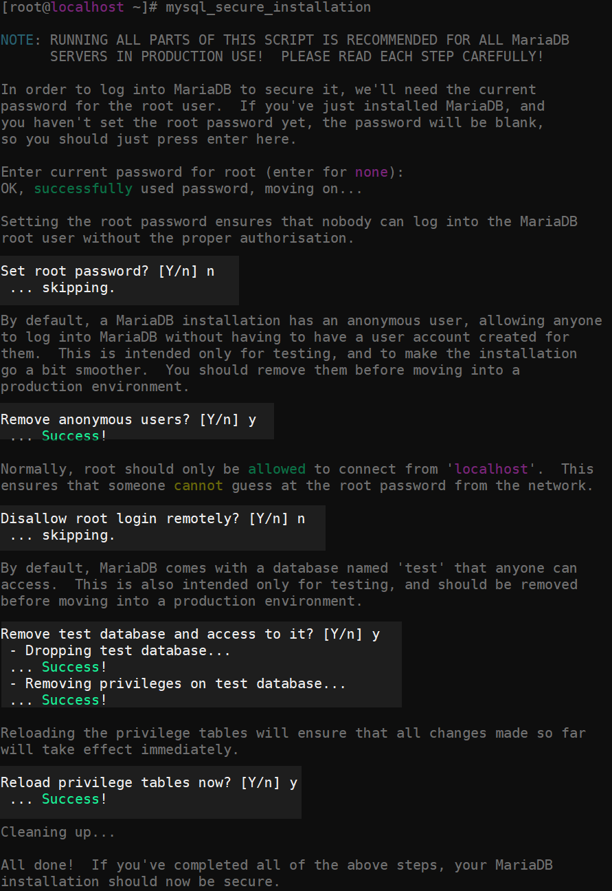

创建 WordPress 数据库和用户
```bash
mysql -u root -p
# 在 MariaDB 控制台输入：
CREATE DATABASE wordpress DEFAULT CHARACTER SET utf8mb4 COLLATE utf8mb4_general_ci;
GRANT ALL PRIVILEGES ON wordpress.* TO 'wpuser'@'localhost' IDENTIFIED BY '';
FLUSH PRIVILEGES;
EXIT;
```
### 四、下载并部署 WordPress

下载 WordPress 并解压
```bash
cd /usr/share/nginx/
curl -O https://cn.wordpress.org/latest-zh_CN.tar.gz
sudo tar -zxvf latest-zh_CN.tar.gz
sudo mv wordpress/* html/
```

设置文件权限

```bash
sudo chown -R nginx:nginx /usr/share/nginx/html
sudo chmod -R 777 /usr/share/nginx/html
```
### 五、配置 PHP 与 Nginx
编辑 `vim /etc/php-fpm.d/www.conf`，将：
```ini
user = apache
group = apache
```
修改为：
```ini
user = nginx
group = nginx
```

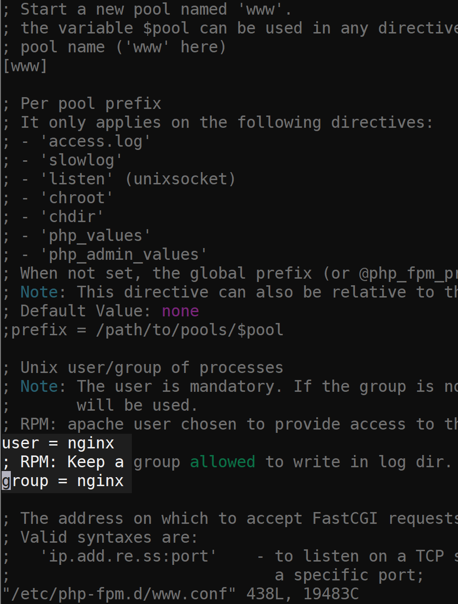
修改完后重启nginx

配置 Nginx 虚拟主机
编辑 `vim /etc/nginx/conf.d/wordpress.conf`：

```bash
server {
    listen 80;
    server_name your_domain_or_ip;

    root /usr/share/nginx/html;
    index index.php index.html index.htm;

    location / {
        try_files $uri $uri/ /index.php?$args;
    }

    location ~ \.php$ {
        include fastcgi_params;
        fastcgi_pass 127.0.0.1:9000;
        fastcgi_param SCRIPT_FILENAME $document_root$fastcgi_script_name;
    }

    location ~ /\.ht {
        deny all;
    }
}
```

```bash
#检查是否有nginx配置错误
nginx -t
#然后重启 Nginx：
sudo systemctl restart nginx
```
# 恭喜你到这里就完成了wordpress搭建
# 我们进入网页图形化安装，打开浏览器输入我们的centos虚拟机ip。进行wordpress设置。

# 点击现在开始
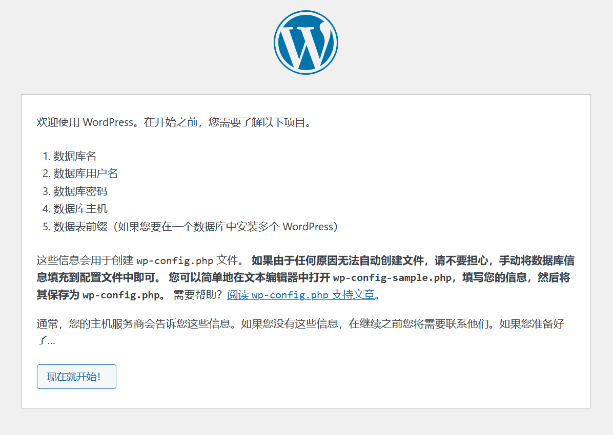

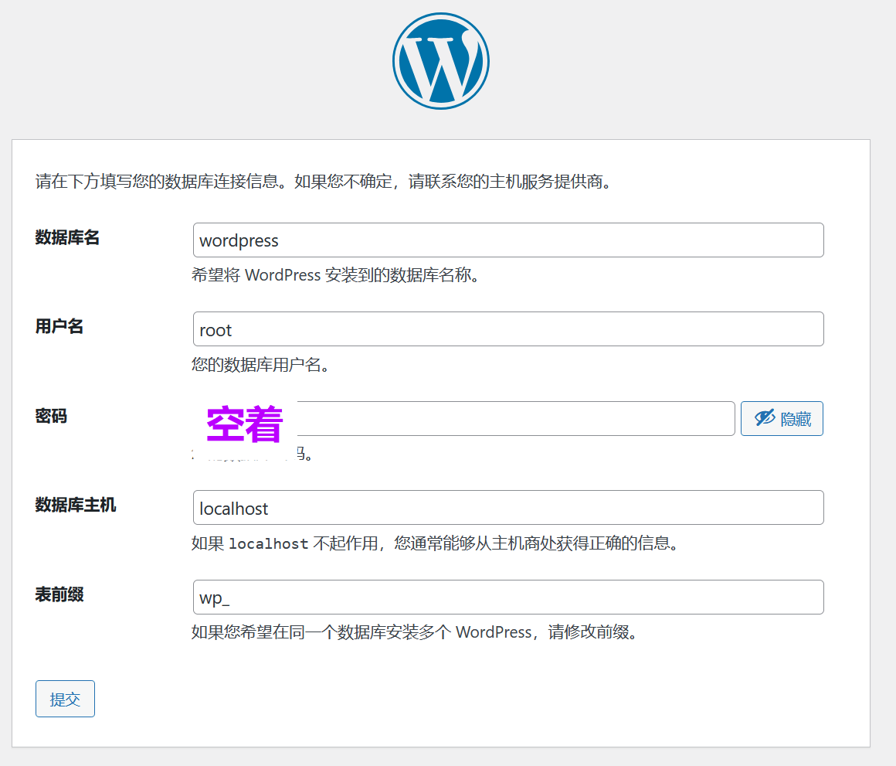


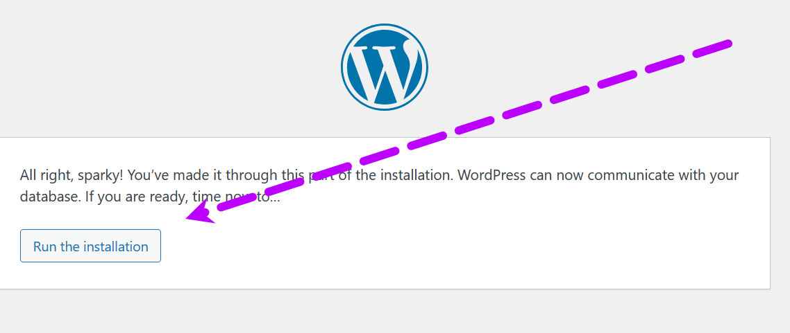

### 这里我们只是教学password可以很简单 但是实际自己使用千万不能用弱密码!
### 邮箱随便写一个
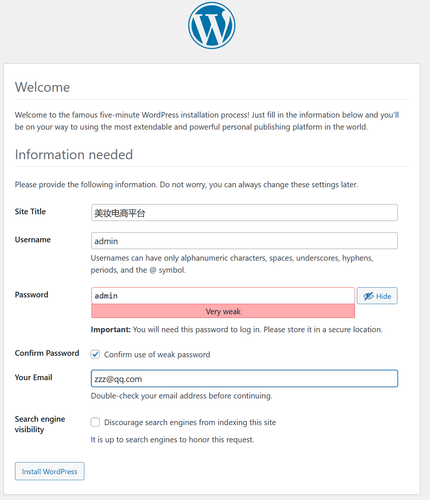

登陆

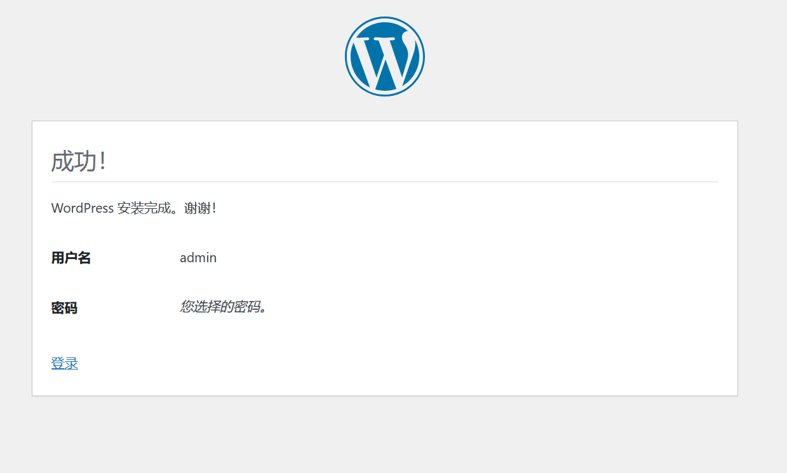
### 我们进入wordpress主页面 点击Plugins 插件
### 点击Add Plugin 添加插件
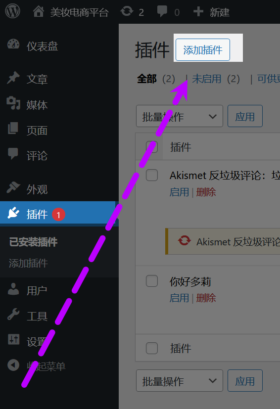

# 我们将使用WooCommerce插件来搭建这个电商平台

---
### 🔧 WooCommerce 是什么？

WooCommerce 是一个基于 WordPress 的 **开源电商插件**，它可以将一个普通的 WordPress 网站变成一个功能强大的 **在线商店**。简单来说，**WooCommerce 就是 WordPress 的“电商引擎”**。

---
你可以用它创建一个完整的电商平台，比如：

- 🛍️ 销售实物商品（化妆品、衣服、电子产品等）
    
- 📦 销售虚拟商品（下载资源、软件许可证等）
    
- 🧾 管理订单、库存和客户
    
- 💳 集成各种支付方式（支付宝、微信、PayPal、Stripe、信用卡等）
    
- 🚚 设置物流配送方式（顺丰、京东、本地配送、自提点等）
    
- 🎯 支持促销、优惠券、会员折扣等

---

![[29.png]]

### 但在安装的时候我遇到了这个问题 我搜索了解决方法
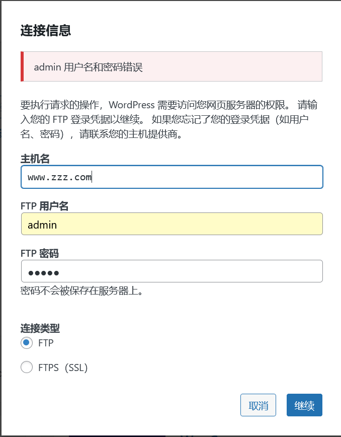

---
编辑 `vim /usr/share/nginx/html/wp-config.php`：

```bash
插入三行，插入在任何第一define下面即可。
define("FS_METHOD", "direct");
define("FS_CHMOD_DIR", 0777);
define("FS_CHMOD_FILE", 0777);
```

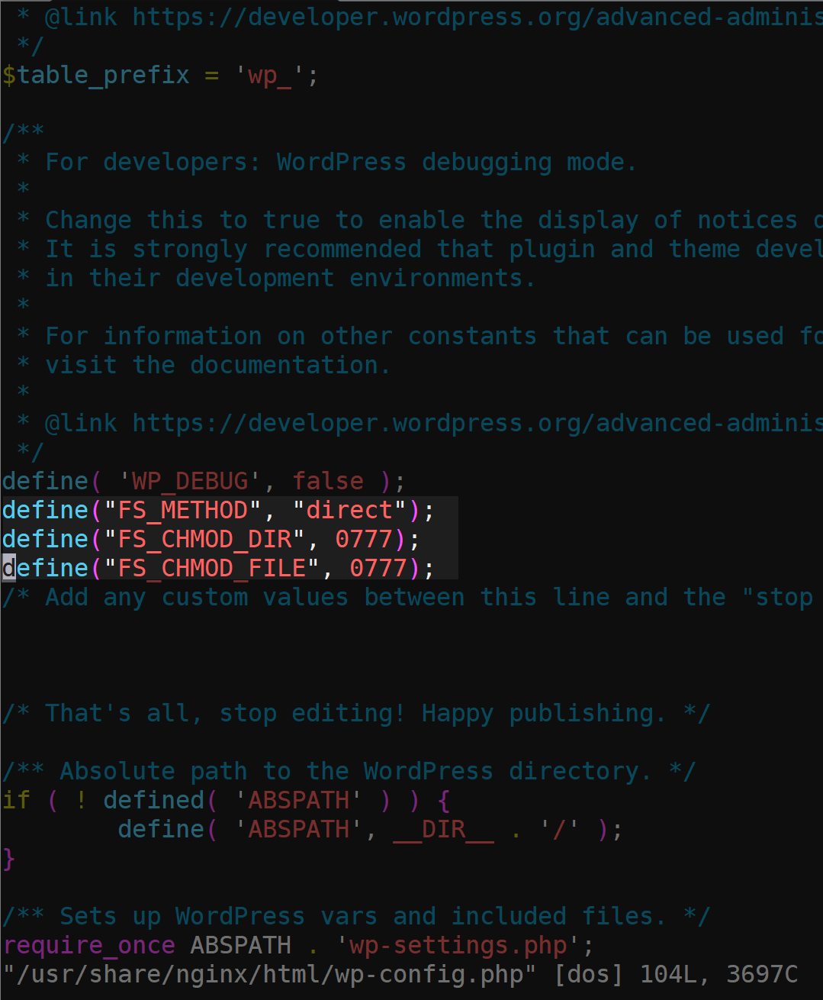

# 添加完后就可以正常安装了
# 点击启用后就可以跟着图形化一步步搭建电商平台
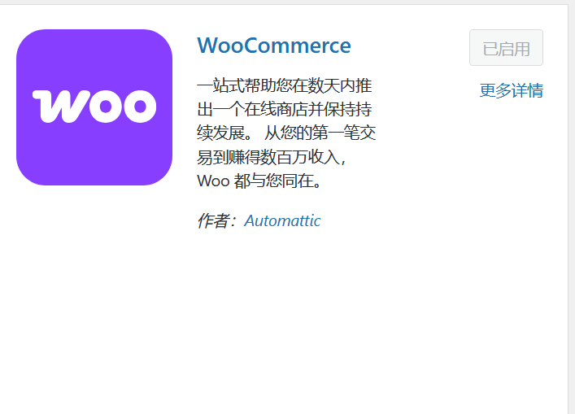
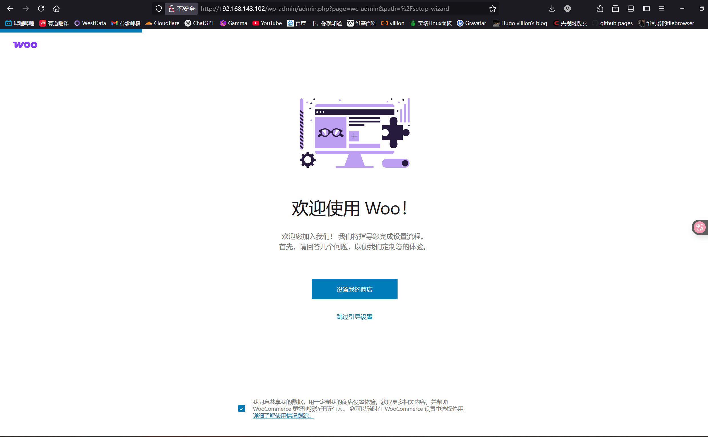

### 但当我们设置完回到wordpress会发现有一个报错
### WooCommerce 正常运行所需的一个或多个表缺失，某些功能可能无法正常工作：缺少表：wp_wc_order_product_lookup
### 这里我们可以手动创建一个
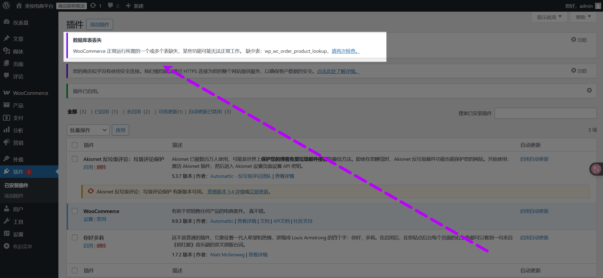

```sql
sudo mysql -u root -p

use wordpress;

CREATE TABLE `wp_wc_order_product_lookup` ( `order_item_id` bigint(20) unsigned NOT NULL, `product_id` bigint(20) unsigned NOT NULL, `variation_id` bigint(20) unsigned NOT NULL DEFAULT 0, `quantity` int(11) NOT NULL DEFAULT 0, `order_id` bigint(20) unsigned NOT NULL, PRIMARY KEY (`order_item_id`), KEY `product_id` (`product_id`), KEY `order_id` (`order_id`), KEY `variation_id` (`variation_id`) ) ENGINE=InnoDB DEFAULT CHARSET=utf8mb4 COLLATE=utf8mb4_unicode_ci;
```

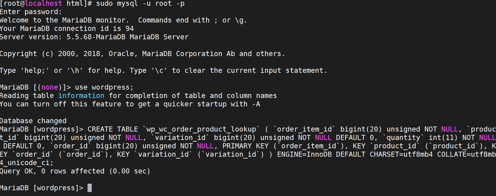

```bash
#重启服务
systemctl restart nginx
systemctl restart mariadb
```
### 添加完表后 完美解决
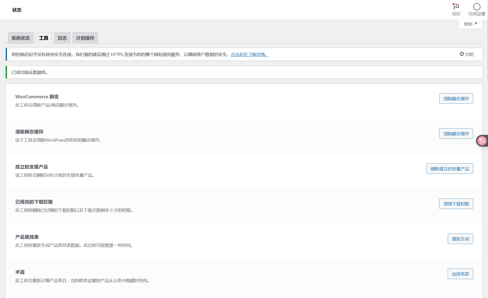

# 感谢您看到这里。具体的WooCommerce 商店的搭建美化我将放在Centos7.9通过Wordpress搭建电商平台（二）中分享。