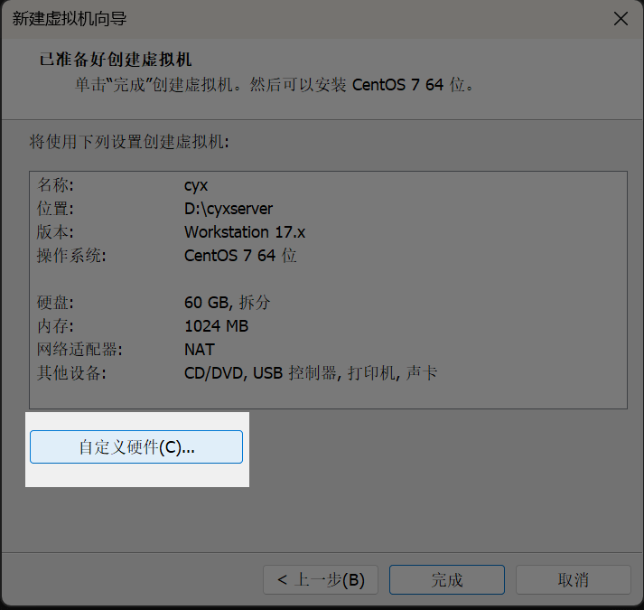

大二下的期末实训课我选择了校内实训，老师要求搭建一个美妆的电商平台。在网站搭建起来后我觉得电子商务还是挺好玩的。在选择搭建方案时，我排除了自主开发前后端原始网站的方案。因为大一时我曾用 HTML+PHP 和 Python 开发过校内内网简易网站，深知从零搭建会面临诸多问题：后端逻辑容易出错、前端样式美观度不足且存在兼容性报错、数据库设计逻辑复杂等。基于以往经验，我果断决定采用成熟的平台模板来搭建电商平台。

Wordpress就是一个不错的选择。此前我曾用它搭建过个人博客，虽然后来觉得设计复杂便不再使用，但至少有过一次安装经验，而且我了解到不少实际运营的跨境电商小型网站都基于WordPress 部署，其丰富的高完成度插件和模板能够满足电商平台的功能需求。

  
在环境选择上，我采用了国内高校常用的 CentOS 7 系统，具体版本为 CentOS 7.9（其他 CentOS 版本亦可）。下面正式分享我搭建美妆电商平台的过程的分享。

### ✅ 什么是 CentOS？

**CentOS（Community ENTerprise Operating System）** 是一个**基于 RHEL（Red Hat Enterprise Linux）的企业级 Linux 操作系统**。

#### 特点：

- **稳定可靠**：广泛用于服务器部署，适合运行 WordPress、数据库、网站等服务。
    
- **开源免费**：相比 RHEL，CentOS 提供类似的功能但完全免费。
    
- **社区支持**：由开发者社区维护，有丰富的教程和支持资料。

---
### ✅ 什么是 WordPress？

**WordPress** 是一个**开源的内容管理系统（CMS）**，主要用于搭建网站和博客。

#### 特点：

- **免费开源**：任何人都可以免费下载、安装、使用和修改。
    
- **简单易用**：不需要会编程就可以搭建出完整网站。
    
- **强大灵活**：支持安装各种主题（美化网站）和插件（扩展功能）。
    
- **用途广泛**：可以搭建博客、企业站、电商网站、论坛、在线课程网站等。

---
# 1.获取Centos7.9 iso镜像文件

这里我们使用阿里云的Centos  iso文件，国内的阿里云镜像下载速度快推荐使用。

 [阿里云Centos7.9开源镜像站](https://mirrors.aliyun.com/centos/7.9.2009/isos/x86_64/)
 
 选择高光处的Centos7_DVD-2009.iso


# 2.通过VM Workstation搭建Centos虚拟机

点击 "创建新的虚拟机"


选择 “典型（推荐）”


选择 “稍后安装操作系统”


客户机操作系统选择Linux（L ） 版本（V）为Centos7 64位


自己自定义一个名字 然后指定虚拟机存放的地方（不要安装到C盘就好）


最大磁盘大小（GB）(S) 修改为 60 稍微大一点


点击自定义硬件



我们修改内存为8GB 处理器 4 
在新CD/DVD（IDE）指定使用ISO映像文件 指定我们刚下载的阿里云centos7.9 iso


在机房的同学需要把网络适配器改为桥接模式，并且勾选复制物理网络连接状态

由于我在寝室我就用Nat模式了


虚拟机到这里就设置完成了 我们点击完成 然后开启虚拟机

在这个页面我们点击键盘 方向↑键 然后回车 选择直接安装centos7 不检查


选择简体中文


点击一下安装位置


双击一下这个磁盘然后点击完成


设置一个root密码 然后等待安装成功


vi  /etc/sysconfig/network-scripts/ifcfg-ens33

修改网卡配置文件


```toml
BOOTPROTO=static
ONBOOT=yes
IPADDR=192.168.143.102
NETMASK=255.255.255.0
GATEWAY=192.168.143.2
DNS1=1.2.4.8
```
保存后 重启网卡
systemctl restart network

关闭防火墙
systemctl stop firewalld

临时关闭selinux
setenforce 0

然后使用mobax连接虚拟机


使用curl 命令 下载centos7 阿里云yum源
curl -o /etc/yum.repos.d/CentOS-Base.repo http://mirrors.aliyun.com/repo/Centos-7.repo


然后下载一个vim看看 有没有配置成功
yum -y install vim


安装成功

# 3.部署Wordpress

### 一、环境初始化与基础配置

```bash
# 更新系统软件包
sudo yum update -y

# 安装必要的工具
yum install -y epel-release yum-utils
```

### 二、安装 Nginx
```bash
#安装nginx
yum install -y nginx 
#启动nginx服务
systemctl start nginx 
#开启自动启动nginx
systemctl enable nginx
```
### 三、安装 Mariadb 数据库
```bash
#安装Mariadb
yum install -y MariaDB-server MariaDB-client  
#启动Mariadb服务
systemctl start mariadb
#开启自动启动Mariadb
systemctl enable mariadb
```
