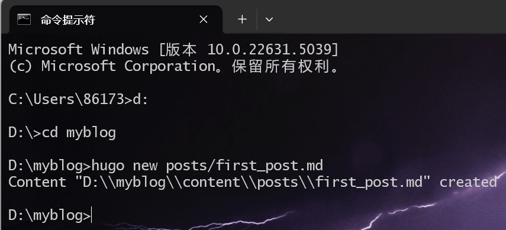
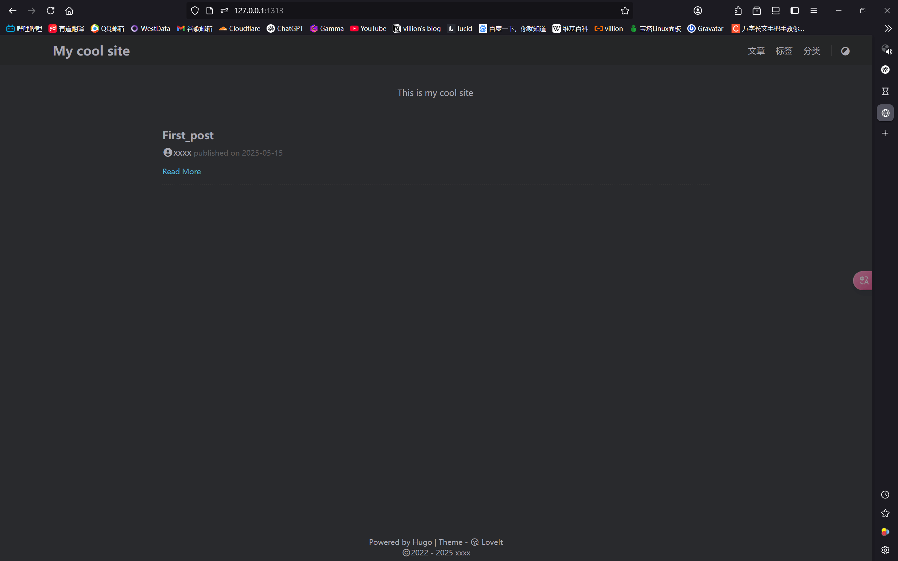

# Hugo + GitHub Pages 是什么？

这是将 **Hugo 静态网站生成器** 和 **GitHub Pages 静态网页托管平台** 相结合，用来搭建一个**快速、安全、免费的博客或网站**的组合方案。最后通过Cloudflare配置CNAME 指向 GitHub Pages。确保你能够通过自定义域名访问你的 GitHub Pages 托管的博客。

## 我们需要准备什么？

- 安装 Hugo网站生成器

- 安装Git Bash 命令行工具

- 通过阿里云万网购买域名（可选）

- 创建Github 账号并且搭建public仓库获得github免费三级域名,设置仓库自定义域名(可选)

- 使用`git push` 命令用于将本地 Git 仓库的提交（commit）推送到远程Github仓库

- 创建Cloudflare 账号，添加自定义域名通过Free套餐配置 DNS（CNAME 指向 GitHub Pages）

- 配置GitHub Actions（CI/CD 自动工作流） 自动部署博客

- 使用使用黑曜石（Obsidian）等md笔记工具来写博客文章，配置git插件自动推送
  

- [Hugo-GitHub网站](https://github.com/gohugoio/hugo)

- [Git Bash](https://git-scm.com/downloads)

- [万网](https://wanwang.aliyun.com/)

- [CloudFlare](https://www.cloudflare.com/zh-cn/)

- [obsidian](https://obsidian.md/download)
  
  
  ## 什么是 Hugo？
  
  ### Hugo 是一种**静态网站生成器**

- 使用 Go 语言开发，**速度极快（毫秒级构建）**。

- 不需要数据库，仅通过 Markdown 文件构建网页。

- 通过命令一键将 Markdown 文章转换为 HTML 静态页面。

- 支持主题系统、标签分类、文章分页、目录自动生成、RSS、SEO、短代码等博客功能。
  
  ## 什么是 GitHub Pages？

### GitHub Pages 是 GitHub 提供的**静态网页托管服务**

- 每个 GitHub 用户或组织都可以免费部署一个网站。

- 只要将 HTML、CSS、JS 等静态文件推送到特定分支（如 `gh-pages`），GitHub 会**自动托管并部署**你的网站。

- 支持自定义域名（绑定你自己的 .com/.cn 域名）。

- 默认启用 HTTPS 安全加密，适合搜索引擎抓取。

## 什么是 Cloudflare？

### Cloudflare 是全球最大的 CDN 和 DNS 服务提供商之一

**Cloudflare 最关键、最实用的功能之一就是支持** ✅ **自定义域名绑定**

- 提供DNS服务，Cloudflare 免费提供超快的域名解析服务（极稳定）。

- 提供HTTPS证书 ，自动为你的自定义域名配置 HTTPS（支持自动续期）。

- 提供智能缓存，为你的域名加速内容访问（CDN 全球缓存）。

- 域名跳转，可将 `yourdomain.com` → `www.yourdomain.com`。

- 等等功能 

## 三者结合是如何工作的？

1. **选择静态博客生成器 Hugo**：用于构建博客内容。

2. **选择 GitHub Pages 托管博客**：托管静态文件，免费提供 GitHub Pages 部署。

3. **使用 Git 进行版本控制**：管理博客源代码和文章更新。

4. **配置 GitHub Actions 自动化部署**：每次推送内容时自动构建并部署。

5. **使用 Cloudflare CNAME 指向 GitHub Pages，跳转自定义域名。

6. **使用 Obsidian 撰写博客文章**：本地编辑 Markdown 文件，提升写作效率。
   
   # 正式教程：
   
   <!--more-->
   
   ## 1. 安装[Git Bash](https://git-scm.com/downloads). 一路默认Next不用任何更改


### 在cmd中输入  git --version 若有版本号即安装成功


### 没有版本回显就在Path变量中增加：C:\Program Files\Git\cmd


## 2. 部署Hugo

### 打开[Hugo-GitHub网站](https://github.com/gohugoio/hugo)下载发行版压缩包


### 选择extended_windows


### 我解压到了D盘hugo


### 将 Hugo 的可执行文件所在目录添加到系统的`PATH`环境变量后，可在任意目录下使用`hugo`命令


### 可能需要重启生效，在cmd中输入  ```hugo version``` 若有版本号即安装成功


## 3. 安装Hugo博客站点

### 打开cmd，进入你希望创建blog的目录，然后输入`hugo new site blog`，其中`blog`是你为博客取的名字，可以根据自己的喜好修改。执行该命令后，Hugo 会创建必要的配置文件和文件夹，并提示你输入一些站点信息，如站点标题、描述等。


这里我想放在E盘,名字就叫myblog



## 4.初始化 Git

### 进入新创建的站点目录，运行`git init`命令进行初始化，将该目录初始化为一个 Git 仓库，以便后续进行版本控制和部署。


## 5.选择和配置主题

## 这里我个人使用Loveit主题 作者github:https://github.com/dillonzq/LoveIt 感谢作者Dillon提供

## 我习惯直接去github手动下载主题压缩包[Loveit](https://github.com/dillonzq/LoveIt)


  

## 把名字改成LoveIt放到我们D盘创建的Hugosite-myblog的themes下面(也就是主题文件夹下面)


### 打开myblog根目录的hugo.toml删除原有配置

### 把以下LoveIt 主题的基本配置粘贴进去:（打开内收代码TOML）

```toml
baseURL = "http://example.org/"

# 更改使用 Hugo 构建网站时使用的默认主题
theme = "LoveIt"

# 网站标题
title = "我的全新 Hugo 网站"

# 网站语言, 仅在这里 CN 大写 ["en", "zh-CN", "fr", "pl", ...]
languageCode = "zh-CN"
# 语言名称 ["English", "简体中文", "Français", "Polski", ...]
languageName = "简体中文"
# 是否包括中日韩文字
hasCJKLanguage = true

# 菜单配置
[menu]
  [[menu.main]]
    weight = 1
    identifier = "posts"
    # 你可以在名称 (允许 HTML 格式) 之前添加其他信息, 例如图标
    pre = ""
    # 你可以在名称 (允许 HTML 格式) 之后添加其他信息, 例如图标
    post = ""
    name = "文章"
    url = "/posts/"
    # 当你将鼠标悬停在此菜单链接上时, 将显示的标题
    title = ""
  [[menu.main]]
    weight = 2
    identifier = "tags"
    pre = ""
    post = ""
    name = "标签"
    url = "/tags/"
    title = ""
  [[menu.main]]
    weight = 3
    identifier = "categories"
    pre = ""
    post = ""
    name = "分类"
    url = "/categories/"
    title = ""

# Hugo 解析文档的配置
[markup]
  # 语法高亮设置 (https://gohugo.io/content-management/syntax-highlighting)
  [markup.highlight]
    # false 是必要的设置 (https://github.com/dillonzq/LoveIt/issues/158)
    noClasses = false
```

## 6.创建你的第一篇文章

### 以下是创建第一篇文章的方法:

```bash
hugo new posts/first_post.md
```



但是默认情况下, 所有文章和页面均作为草稿创建. 如果想要渲染这些页面, 请从元数据中删除属性 `draft: true`, 设置属性 `draft: false`



## 7.在本地启动网站

### 使用以下命令启动网站:hugo本地运行默认为1313端口

```bash
hugo serve
```

### 浏览器搜索 `http://localhost:1313`.

# 🎉恭喜你开启了你的Hugo Blog


