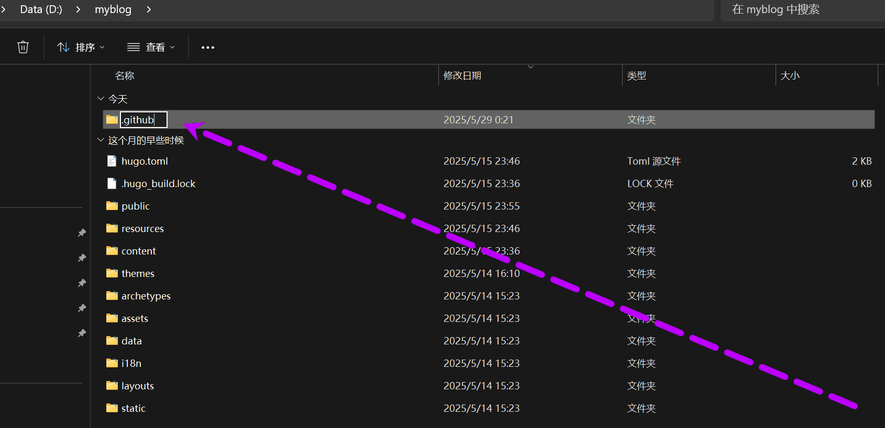
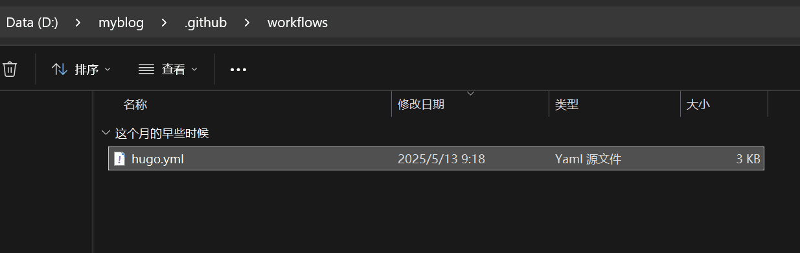
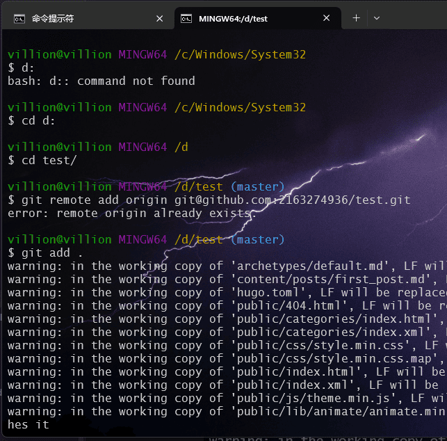
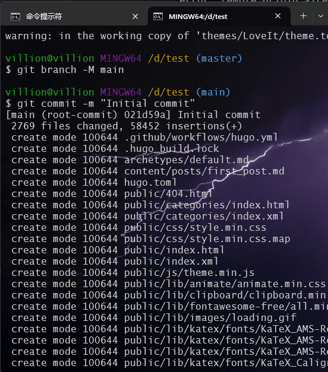
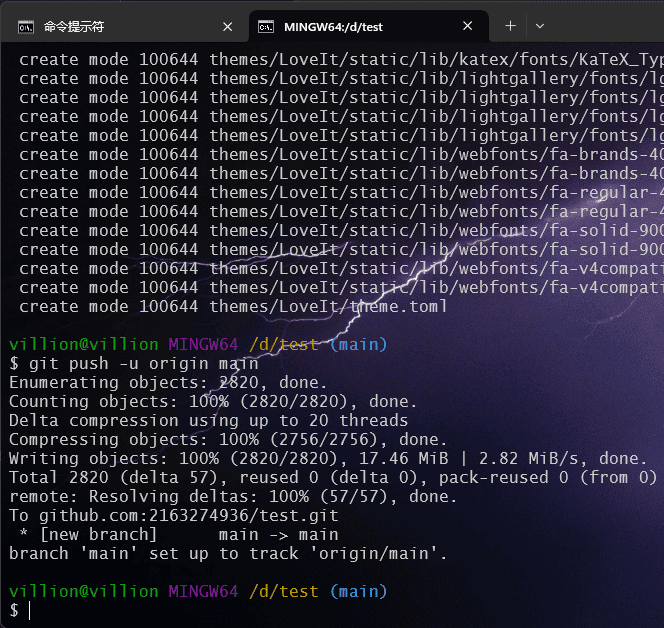
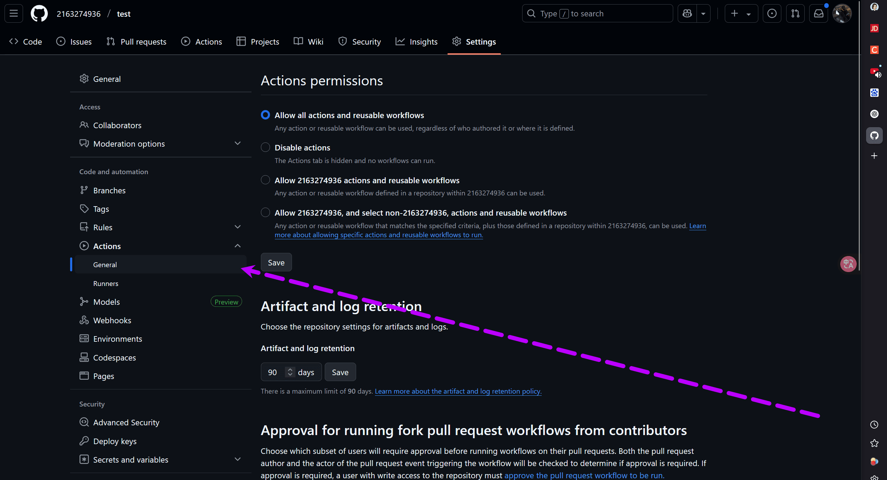
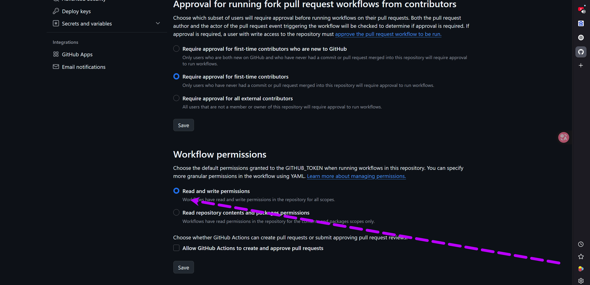
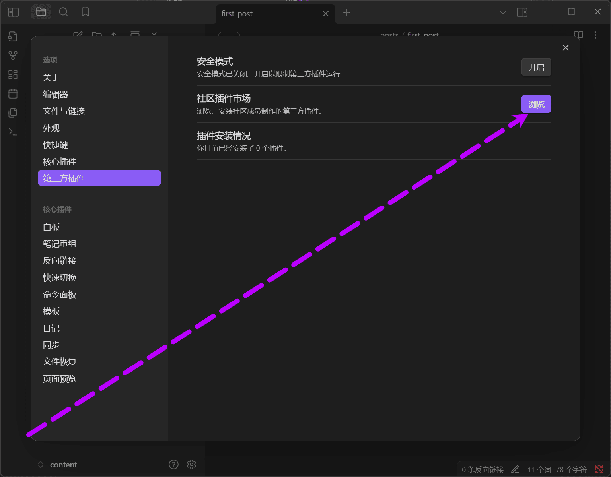
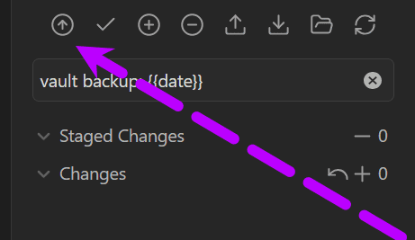

## 在上一章本地运行hugo后我们将它推送到github仓库托管。
## 为什么要推送到github pages托管？

- **自定义域名**：GitHub提供免费二级域名，还可以自定义域名跳转增加个人属性

- **版本控制**：GitHub提供完善的版本管理，方便回滚

- **跨设备同步**：任意设备上更新代码或文章都能同步到线上。

- **备份安全**：仓库在云端，防止本地数据丢失。

# 正式教程：
## 首先需要注册github账号，这里我不做解释。登陆成功后点击左上角“New”新建一个github仓库


## 这里全部默认只有一点要注意：

### 仓库名字必须为==github账号==的用户名也就是username，而不是你的别名。以我的账号为例子 我的用户名(username)是2163274936 ，别名(name)是villion.所以我们的仓库名字应该是2163274936


这里我建立了一个test仓库用于演示

## **部署至 GitHub Pages**：

### 自动化部署
        - 在站点根目录创建 `.github/workflows` 目录，添加 YAML 配置文件（ `hugo.yml`），配置 GitHub Actions 自动拉取代码、运行 Hugo 构建、推送至 `gh-pages` 分支。
这里的自动化并不是push自动化 而是在每次git push后将原本需要
手动部署这个过程：`hugo` 构建静态文件 → 将 `public` 目录内容手动推送到 `gh-pages` 分支。
自动化部署通过 Actions 脚本，将上述步骤封装为自动流程，无需每次手动操作。



创建hugo.yml 
将下面给出的自动化推送代码复制粘贴进去

```toml
name: Hugo Build and Deploy

  

on:

  push:

    branches:

      - main

  

jobs:

  build-and-deploy:

    runs-on: ubuntu-latest

    steps:

      - name: Checkout

        uses: actions/checkout@v4

        with:

          submodules: true

          fetch-depth: 0

  

      - name: Setup Hugo

        uses: peaceiris/actions-hugo@v2

        with:

          hugo-version: '0.147.2'

          extended: true

  

      - name: Cache dependencies

        uses: actions/cache@v3

        with:

          path: |

            resources/_gen

            public

          key: ${{ runner.os }}-hugo-${{ hashFiles('**/package-lock.json') }}

          restore-keys: |

            ${{ runner.os }}-hugo-

  

      - name: Check and preserve CNAME

        run: |

          if [ -f "CNAME" ]; then

            echo "✅ CNAME 文件存在，将在构建后复制到public目录"

          else

            echo "❌ 未找到CNAME文件，检查GitHub Pages设置中的自定义域名"

            if [ -n "$CUSTOM_DOMAIN" ]; then

              echo "使用环境变量中的域名创建CNAME文件"

              echo "$CUSTOM_DOMAIN" > CNAME

            else

              echo "⚠️ 未设置CUSTOM_DOMAIN环境变量，将使用GitHub Pages默认域名"

            fi

          fi

  

      - name: Build

        env:

          HUGO_ENV: production

          CUSTOM_DOMAIN: ${{ secrets.CUSTOM_DOMAIN }}  # 从GitHub Secrets获取域名

        run: |

          hugo version

          hugo --minify --gc --cleanDestinationDir

          # 构建后始终复制CNAME文件，确保覆盖public目录

          if [ -f "CNAME" ]; then

            cp CNAME public/

            echo "✅ CNAME文件已复制到public目录"

          fi

          echo "构建完成，输出内容:"

          ls -al public

  

      - name: Deploy to GitHub Pages

        uses: peaceiris/actions-gh-pages@v4

        with:

          github_token: ${{ secrets.GITHUB_TOKEN }}

          publish_dir: ./public

          publish_branch: gh-pages

          force_orphan: true

          commit_message: ${{ github.event.head_commit.message }}
```
配置完 **GitHub Actions**后
我们先手动推送一下 看看有没有报错后续再配置自动git推送
这里大家只需要参考命令 回显不需要看
```bash
# 0. 将本地仓库与远程 GitHub 仓库建立连接
git remote add origin git@github.com:2163274936/test.git
# 1. 添加所有文件到暂存区
git add .

# 2. 提交到本地仓库（必须执行）
git commit -m "Initial commit"

# 3. 推送至 GitHub（若本地是 main 分支）
git push -u origin main
```
我们也可以看github的教程就在创建仓库的地方 如果一直有报错自行解决



推送成功后我们回到github仓库 发现文件已经上来了

但却有一个报错  其实

这个错误是由于 GitHub Actions 的默认权限配置导致的。当你使用 `peaceiris/actions-gh-pages@v4` 这个 Action 时，需要确保 GitHub Actions 工作流有权限推送到你的仓库。

我们点击settings - Actions - General 

拉到最下面 点击read and write 给予Workflow(工作流)读写权限 别忘了“save”保存

## 通过黑曜石（Obsidian）来更新hugo blog 文章并添加Git插件一键git push：
使用黑曜石（Obsidian）来更新 Hugo 博客的原因主要与其独特的笔记管理能力、文件兼容性和工作流优势有关。

Hugo 博客本质上是通过 Markdown 文件生成静态页面，而黑曜石的笔记文件天然兼容 Markdown 格式。只需将黑曜石中的笔记导出或直接复制到 Hugo 项目的`content`目录下，即可直接用于博客构建，无需格式转换。

在《Windows 系统中基于 Hugo + GitHub Pages + Cloudflare 搭建个人博客（一）》中，已提及 Obsidian 黑曜石的官方网站，此处不再重复。

我们需要完成以下操作：下载黑曜石，打开软件，添加仓库。
点击"打开本地仓库" 选择我们D盘下的myblog 里hugo存放文章的content

这就是Obsidian的主界面我们在这里写文章。
关于如何操作黑曜石我放在后续的分享里，这里不过介绍。
点击设置按钮 我们要添加git插件

点击 “第三方插件” - 关闭安全模式后可以下载插件
 
 点击浏览按钮
 
 搜索Git 第一个就是我们要下载的插件
 
 安装后点击 '启用'
 
 这里点击选项有一些自动定时推送 但我个人觉得不一定要配置 手动git push 可能更加安全
 
 左侧为我们刚下载的插件 右侧为推送的目录 这里Obsidian的git 插件会自动识别的仓库地址 
 我们要推送只需要点击向上箭头的按钮 因为我们上面手动初始化了本地仓库并配置了 remote；
 