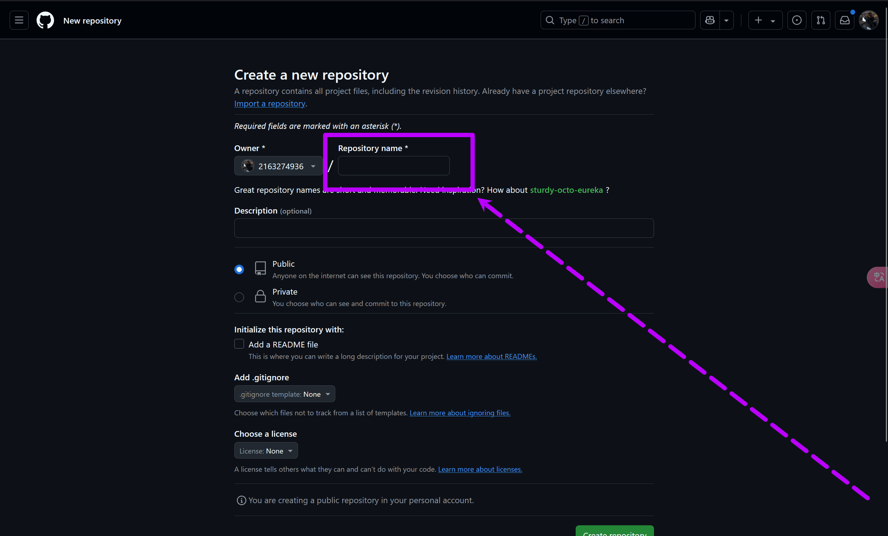

## 在上一章本地运行hugo后我们将它推送到github仓库托管。
## 为什么要推送到github pages托管？

- **自定义域名**：GitHub提供免费二级域名，还可以自定义域名跳转增加个人属性

- **版本控制**：GitHub提供完善的版本管理，方便回滚

- **跨设备同步**：任意设备上更新代码或文章都能同步到线上。

- **备份安全**：仓库在云端，防止本地数据丢失。

# 正式教程：
## 首先需要注册github账号，这里我不做解释。登陆成功后点击左上角“New”新建一个github仓库

## 这里全部默认只有一点要注意：
### 仓库名字必须为==github账号==的用户名也就是username，而不是你的别名。以我的账号为例子 我的用户名(username)是2163274936 ，别名(name)是villion.所以我们的仓库名字应该是2163274936

