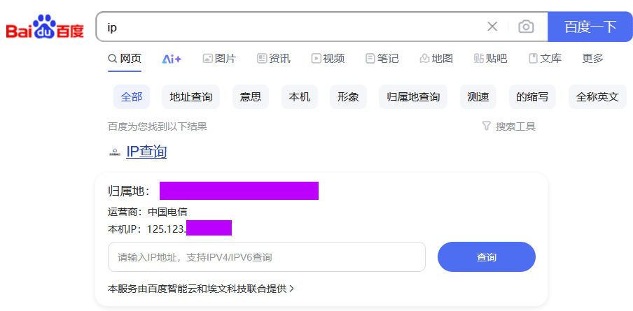
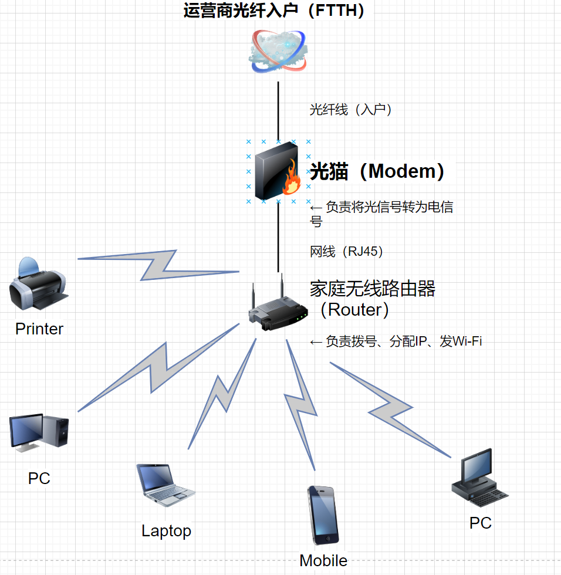

 大二时购入阿里云的服务器搭建个人博客，主要看中其提供的公网 IP。首年购机费用低廉，图形化管理面板功能便捷。但低价也带来了一系列问题：上行带宽低、服务器性能不足、内存小、存储空间有限，且续期费用昂贵。
 于是我产生了想法：购买一台实体主机，配备公网 IP，这不就相当于拥有了一台永久的、性能强劲且存储充裕的个人私有云服务器吗？将其接入家庭宽带，实现更宽裕的上行带宽，异地通过 RDP 也能流畅使用。

## ✅ 一、什么是阿里云服务器

**阿里云服务器**，也叫 **ECS（Elastic Compute Service，弹性计算服务）**，是阿里云提供的一种虚拟云主机。它类似于传统的物理服务器，但运行在云平台上，用户可以随时申请、配置、扩展、关闭或销毁它。
### 🔧 主要特点：

- **按需计费**（包年包月或按量计费）
    
- **可远程访问**（通常通过 SSH 或 RDP）
    
- **可安装任意系统**（Windows/Linux）
    
- **支持公网访问**（需要绑定公网IP）
    
- **适合搭建网站、数据库、开发环境、应用后台等**

## ✅二、什么是公网 IP（Public IP）

- **作用**：用于访问互联网，能被外网访问。但容易暴露攻击面。
    
- **例子**：服务器、网站、远程桌面等都需要公网 IP。
    
- **示例地址**：`123.45.67.89`
---

## ✅ 三、什么是内网 IP（Private IP）

- **作用**：只在局域网内部使用，不能被外网直接访问。相对更安全。
    
- **例子**：家里 Wi-Fi 连接的手机、电脑、电视。
    
- **常见地址段**：
    
    - `192.168.x.x`
---
# 正式教程:

## 一、设备选购：
首先，我们需要选购一台实体主机作为服务器（私有云）主体。由于这是云服务器，不会涉及游戏场景，所以我们并不需要独立显卡。到 2025 年，集成显卡的性能早已突飞猛进，完全可以满足我们的日常需求。在 B 站 “龙翔可乐” 老师一系列关于迷你（mini）主机推荐的视频下，我选择了来自铭凡的 “UM760 Plus” 成品主机。mini主机小巧轻便，不占桌面空间。完美适配个人私有服务器。

由于我不懂电脑选购，这里我给出可乐老师的视频链接#[ mini主机新手入坑指南——2025年5月迷你主机推荐合集（含补）](【mini主机新手入坑指南——2025年5月迷你主机推荐合集（含国补）】 https://www.bilibili.com/video/BV1KALdzXE7j/?share_source=copy_web&vd_source=6846c505d708bbf3e98b49bc562f645f)
我购买的 UM760 Plus 在享受国补优惠后，入手价格为 1999 元。这台机器内存出厂默认是单根 16G，用户完全可以自己加装一根 16G 的内存条，将内存扩展到 32G。它还配有单个 2.5G 网口，以及 OCulink 转接口，通过这个转接口还能外接显卡，整体性价比很高。

## 二、操作系统OS选择：
操作系统个人建议选择Windows，我们的实体主机性能足够运行windows。并且图形化的界面方便操作。我选择的铭凡UM760 Plus出厂自带windows11操作系统，无需手动安装。

## 三、申请公网IP：

我认为搭建私有云服务器的难点只有两个：第一是获取公网 IP。网络上很多帖子称，申请公网 IP 时被拒搞得焦虑感蔓延，但我在实际申请中并未遇到太多阻碍 —— 只要真诚、不带有目的性且有礼貌地与客服沟通，修改公网 IP 的过程就十分顺利。当然，这可能存在地区差异。
 
 以下分享我申请公网 IP 的详细沟通过程，供大家参考：

我的定位为浙江。家中宽带为中国电信。

1. **接通人工服务**  
    拨打 10000 电信客服，系统语音提示后，直接说 “人工服务”。若首次未接入，可重复表达 “转人工”，约 2 次后会转接至真人客服。
    
2. **前期信息铺垫**  
    接通人工客服后，避免直接提 “申请公网 IP”，先按以下流程沟通：
    
    - 咨询家庭宽带相关问题，我先表述：“想查一下家里宽带。”
    - 客服需要你提供装机地址、开户人姓名及身份证号。
    - 查到宽带后询问宽带套餐配置、剩余话费，降低沟通目的性。
3. **提出公网 IP 需求及话术**  
    最后再提出修改为公网IP的需求。你提出需求后客服会问：“你修改公网的目的是什么?”
    我的回答是：“家里给老人装了监控，需要公网 IP。”

我接通的客服二话不说直接帮我修改。即刻生效。为中国电信点赞👍
等待大约10min，待光猫重启完后。我们百度搜索 "ip"

## 四、更改光猫为桥接模式：
这是搭建过程中的第二个难点。以下分享我向客服申请更改光猫为桥接模式的详细沟通过程，供大家参考：
务必重新拨打客服电话，接入人工服务后留意是否为申请公网 IP 时的同一位客服。若为同一人，直接挂断后重新拨打，避免对方拒绝更改。依旧按老流程先咨询宽带信息，如套餐配置、账户余额等，最后再提出申请：“麻烦帮忙远程把光猫改成桥接模式。” 客服可能会询问目的，我的回答是：“家里买了个昂贵的华硕电竞路由器，想让路由器拨号上网。” 
当时接通的客服没过多追问，直接帮我远程完成了桥接模式的更改。

## 五、设置路由器为拨号：
在光猫更改为桥接模式后，家里的wifi是上不了网的。为了不影响家人正常使用网络一定要熟悉流程后再进行这一系列操作。要提前获取宽带的账号密码(用于用户拨号上网)，正常登入路由器的管理web页面。**如果账号密码不知道使用开户的账号拨打客服修改。**

为了更好理解我给出我家中的宽带网络拓扑图以及介绍家庭路由器、光猫、PPPOE拨号、桥接模式的概念:

## 🏠 什么是家庭路由器（Router）？

### ✅ 定义：

**家庭路由器**是用来连接互联网，并在家中不同设备之间分配网络的设备。它让你家里的手机、电脑、电视等都能通过 **有线或无线 Wi-Fi** 连接到互联网。

### ✅ 功能：

- **拨号上网**（比如使用 PPPoE）
    
- **分配内网 IP**（DHCP）
    
- **提供无线 Wi-Fi 信号**
    
- **网络防火墙、端口映射**
    
- 管理网络速度、家长控制等

---

## 🔌 什么是光猫（光纤猫/光调制解调器）？

### ✅ 定义：

**光猫**（全称：光纤调制解调器），是一种用来把 **光纤信号**转换成 **电信号（以太网）** 的设备，是连接运营商网络的“入口”。

### ✅ 功能：

- **接收光纤信号**（从外面来的网络）
    
- **转换成网络接口（RJ45）** 供路由器使用
    
- 可能具有拨号、分配 IP、Wi-Fi 等简单路由功能
    
- 有些光猫还带 IPTV 接口、电话接口

---

### 🔍 什么是 PPPoE 拨号？

**PPPoE** 是一种网络协议，它允许用户通过 **以太网接口**连接到互联网服务提供商（ISP），并进行类似“拨号上网”的认证流程。使用 PPPoE 时，你需要输入 ISP 提供的：

- **用户名**
    
- **密码**
    

这种方式就像老式的“拨号上网”，但它运行在现代的以太网上。

---

### 🔧 什么是光猫桥接模式：
**光猫桥接模式**（Bridge Mode）是指将光猫（光纤调制解调器）设置为 **不进行拨号、不分配内网IP**，而是将宽带信号“透传”给后端的路由器，让路由器来负责拨号上网（如 PPPoE）、分配局域网 IP 等功能。

正常光猫默认是“路由模式”：

- 光猫自己拨号上网（PPPoE），
    
- 自己做DHCP服务器，给家里设备分配IP；
    
- 一般IP段为 `192.168.1.x`。
    

而**桥接模式**是这样工作的：

- 光猫**不拨号**，只做一个纯粹的数据中转；
    
- 路由器负责拨号，获取公网IP；
    
- 网络管理、安全设置等全部交由路由器控制。

---
我家中的路由器型号为